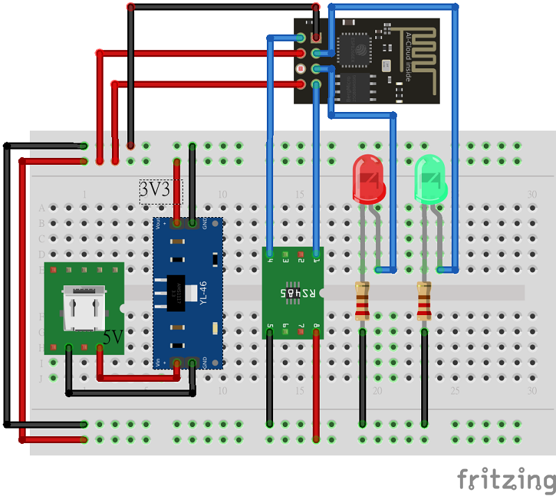
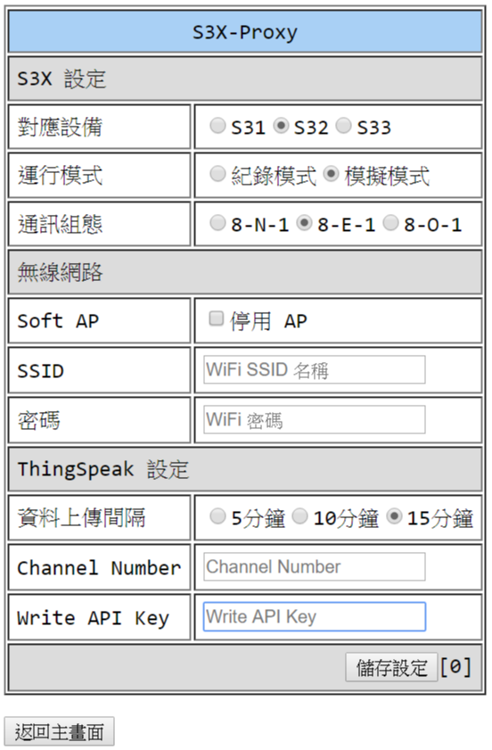

S3X Proxy
=========

【功能說明】
-----------
* 接受 Client 連線，提供資訊與命令控制。

【設定步驟】
-----------
1. 連上名稱 S3X-Proxy_XXXXXX 無線 SSID。
2. 連入 http://192.168.4.1 網頁。
3. 按【設定】修改相關設定。
4. 通訊組態：ESP8266 建議用 8-E-1，Arduino Uno、Nano...建議用 8-N-1。
5. 將 S3X Proxy 連接上 RS-485 線路。
> 

【後續連線】
-----------
* 當無線網路 SSID 與 密碼 設定好了可以正常連線時，紅色LED 應該是恆亮。
* 此時可以連入 http://s3x-proxy.local/ 網頁，查看相關資訊與設定。
